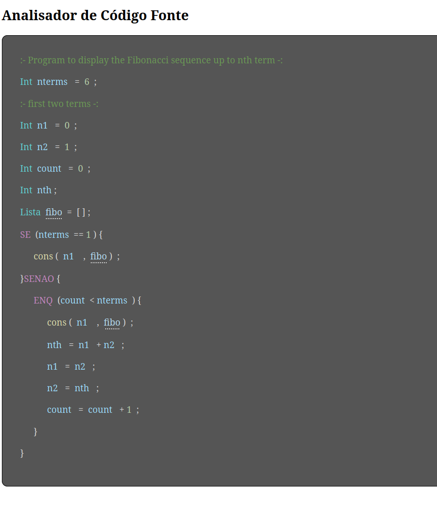
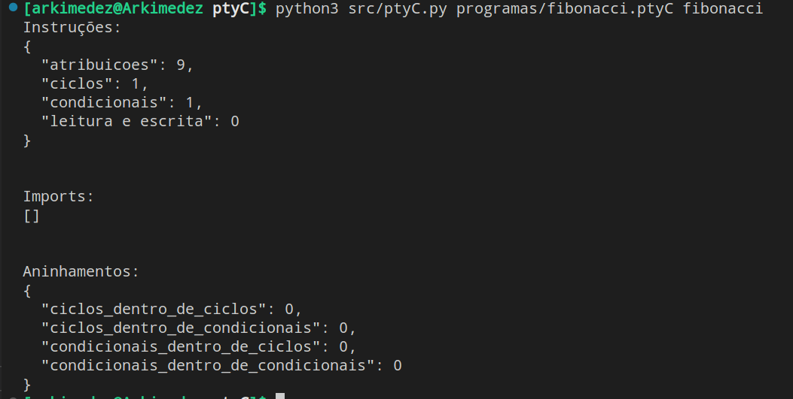

# PtyC

## Introdução

- PtyC é uma linguagem desenvolvida com vista a aproveitar as vantagens das linguagens Python e C.
- Para além disso, esta linguagem tem sintaxe em português.

## Exemplo de um programa em PtyC

```
IMPORTA {pacote_a_importar}

:- exemplo de programa -:

Int v = 0;
Int h = 2;
Int x;
Array s = {1,2,3,4,5};
Int r;

ESCOLHE (h) {
    CASO (2) {r = 0 ;}
    CASO (4) {r = s[2] + h ;}
    CASO (7) {r = h ;}
    CASO () {r = 0 ;}
}


DEF Boolean func1 (v, h, x, s) {
    
    SE (v == 0 E h < 4) {
        x = v + 9 - s[3];
    } SENAO {
        x = 0;
    }

    RETORNA v > h ;
}

func1(v, h, x, s);
```

## Declarações e atribuições

- Uma variável considera-se declarada quando é especificado o seu tipo e identificador.
```
Int v;
```

- Considera-se que foi atribuído um valor a uma variável quando este é especificado da seguinte forma:
```
v = 0;
```

- Estas duas ações podem ser realizadas "em simultâneo".
```
Int v = 0;
```

## Funções

### Chamada de funções

- Para chamar uma função, é necessário escrever o nome dela.
```
func1(v, h, x, s);
```

### Definição de funções

- Para definir uma função, é necessário colocar o token DEF, seguido do tipo, nome, argumentos e corpo da função.
- As funções podem retornar um valor no fim, o que é conseguido através do token RETORNA.
- Não é possível definir funções no corpo de outra função/estrutura.
```
DEF Boolean func1 (v, h, x, s) {
    RETORNA v > h ;
}
```

### Funções pré-definidas

- As funções cons, snoc, head e tail estão pré-definidas pela linguagem.
- Não é possível redefinir estas funções.

## Estruturas de seleção

### SE ... SENAO

- Executa um bloco de código se a condição verificada for apresentada.
- Pode ou não conter um SENAO, que executa um bloco de código se a condição não for verificada.
```
SE (v == 0 E h < 4) {
    x = v + 9 - s[3];
} SENAO {
    x = 0;
}
```

### ESCOLHE

- É definido alguns valores que a variável de decisão pode assumir.
- É executado o bloco de código correspondente ao valor que a variável tem.
- É necessário o último caso ser um default, ou seja, o bloco de código que é executado se a variável não tiver nenhum dos valores especificados.
```
ESCOLHE (h) {
    CASO (2) {r = 0 ;}
    CASO (4) {r = s[2] + h ;}
    CASO (7) {r = h ;}
    CASO () {r = 0 ;}
}
```

## Estruturas de ciclos

### ENQUANTO

- Repete um bloco de código enquanto uma condição lógica se verificar.
```
ENQ (5 EM p) {
    func2(q, w);
}
```

### REPETIR ... ATE

- Repete um bloco de código até uma condição lógica se verificar.
```
REPETIR {
    r = r - 1;
} ATE (r < 4)
```

### PARA

- O bloco de código é repetido enquanto a variável antes de "DE" percorre a lista especificada.
```
PARA (i DE [1,2,3]) { 
    k[8] = 9 + jd;
}
```

## Comentários

- Todos os comentários estão envolvidos pelo identificador ```:- -:```.
- Podem ter várias linhas, sem ser necessário especificar isso com sintaxe diferente.
```
:- este comentario 
tem multiplas linhas -:
```

## Imports

- Para importar pacotes, coloca-se o token IMPORTA seguido do pacote a importar entre {}.
- Não é possível fazer imports no corpo de uma função/estrutura.
```
IMPORTA {pacote_a_importar};
```


----------------------------------------------------------------


# Como executar o programa

```bash
python3 src/ptyC.py programas/{programa_input} {nome_HTML}
```

------------------

# Exemplo de um output HTML gerado e as estatísticas do programa, colocados na linha de comandos



